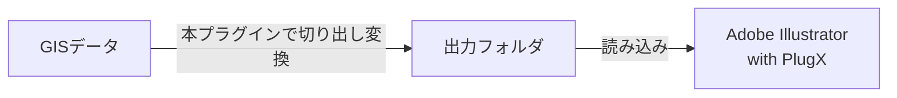

# QGIS to Illustrator with PlugX


このリポジトリでは、Adobe IllustratorでGISデータを読み込みためのソフトウェア`PlugX with QGIS（仮）`向けに、GISデータをエクスポートするためのQGISプラグインを管理します。

## 本プラグインとPlugXの連携方法について



## 使い方

```planetext
本プラグインで出力した結果を読み込むには、別途「PlugX with QGIS（仮）」の導入・インストールが必要です。
```

1. QGISで本プラグインをインストール

2. エクスポートするQGISプロジェクトを開く

3. プラグインのメイン画面を開く

4. エクスポートしたいレイヤーを選択する・切り出す範囲を選択する

5. 処理を実行する

6. 出力フォルダをPlugX with QGIS（仮）で読み込む

<!-- PlugXの操作画面 -->

## 備考

- データのサイズによっては処理に時間がかかることがあります。
- QGIS上の全てのシンボルには対応していません。対応しているシンボル一覧は[こちら](./docs/SYMBOLS.md)を参照してください。
    - 対応していないシンボルは、デフォルトのシンボルに置き換えられるか、読み飛ばされます。
- もし不具合があれば、[Issues](https://github.com/MIERUNE/qgis-plugin-for-plugx/issues)にて報告していただけると、改善につながります。