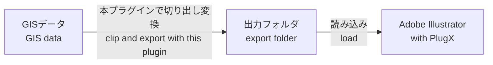
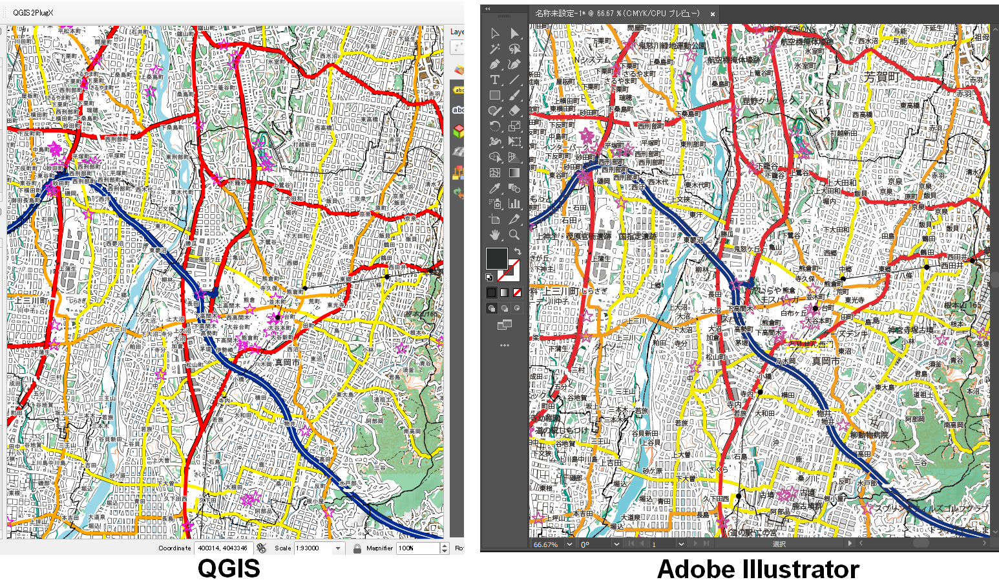

# QGIS to Illustrator with PlugX


このリポジトリでは、Adobe IllustratorでGISデータを読み込みためのソフトウェア`PlugX-QGIS`向けに、GISデータをエクスポートするためのQGISプラグインを管理します。<br><br>
This plugin exports GIS data in a folder, which can be read and imported into Adobe Illustrator using an add-on called `PlugX-QGIS`.

## 本プラグインとPlugX-QGISの連携方法について / How to use this plugin with PlugX-QGIS





https://github.com/MIERUNE/qgis-plugin-for-plugx/assets/26103833/c717b613-8569-4f28-9ca7-462e1b984c83


## 使い方 / Usage

```planetext
本プラグインで出力した結果を読み込むには、別途「PlugX-QGIS」の導入・インストールが必要です。

To read the results exported by this plugin, the installation of "PlugX-QGIS" into Adobe Illustrator is required.
```

|使い方| Usage | 
|--------------------|-----|
| 1. QGISで本プラグインをインストール     |1. Install this plugin in QGIS. | 
| 2. エクスポートするQGISプロジェクトを開く|2. Open the QGIS project you want to export.| 
| 3. プラグインのメイン画面を開く  | 3. Open the plugin’s main window.| 
| 4. エクスポートしたいレイヤーを選択する・切り出す範囲を選択する  | 4. Select the layers you want to export and choose the area to crop.| 
| 5. 処理を実行する |5. Run the process. | 
| 6. 出力フォルダをPlugX-QGISで読み込む  | 6. Load the output folder in PlugX-QGIS.| 

<!-- PlugXの操作画面 -->

## 備考 / Remarks

- データのサイズによっては処理に時間がかかることがあります。
- QGIS上の全てのシンボルには対応していません。対応しているシンボル一覧は[こちら](./docs/SYMBOLS.md)を参照してください。
    - 対応していないシンボルは、デフォルトのシンボルに置き換えられるか、読み飛ばされます。
- もし不具合があれば、[Issues](https://github.com/MIERUNE/qgis-plugin-for-plugx/issues)にて報告していただけると、改善につながります。

- Processing may take time depending on the size of the data.
- Not all symbols in QGIS are supported. Please check [this list](./docs/SYMBOLS.md) for supported symbols.
    - Unsupported symbols will be replaced with default ones or ignored.
- If you encounter any issues, please report them in the [Issues](https://github.com/MIERUNE/qgis-plugin-for-plugx/issues) section to help us improve.
