# Symbol Specification

- QGIS Symbol -> JSON への変換仕様を定義します
- QGISの1レイヤーには1個以上のSymbolLayerが含まれます
- 通常は1SymbolLayer=1Symbolですが、一部特殊なSymbolLayerは複数のSymbolを含むことがあります（例：FilledMarker）
- ひとつのSymbolLayerは、ひとつのシェープファイルに対応します

## Point

### simple (SimpleMarker)

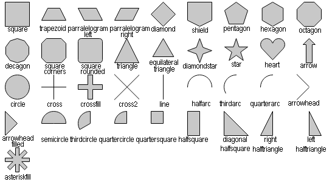

```json
{
  "type": "simple",
  "size": 10,
  "color": "#ff0000ff",
  "outline_color": "#ff0000ff",
  "outline_width": 2,
  "outline_penstyle": {
    "stroke": "solid", // nopen | solid | dash | dot | dashdot | dashdotdot | customdash
    "join": "bevel", // miter | bevel | round
    "cap": "square" // flat | square | round
  },
  "shape": "circle", //square | diamond | pentagon | hexagon | triangle | equilateraltriangle | star | arrow | circle | cross | crossfill | cross2 | line | arrowhead | arrowheadfilled | semicircle | thirdcircle | quartercircle | quartersquare | halfsquare | diagonalhalfsquare | righthalftriangle | lefthalftriangle | trapezoid | parallelogramleft | parallelogramright | shield | octagon | decagon | squarecorners | squarerounded | diamondstar | heart | halfarc | thirdarc | quarterarc | asteriskfill
  "offset": [0.0, 0.0],
  "rotation": 0.0, //degrees, 時計回り
  "level": 0,
  "opacity": 1.0 // 透過度: 0.0 ~ 1.0
}
```

### svg (SvgMarker)


```json
{
  "type": "svg",
  "size": 10,
  "color": "#ff0000ff",
  "outline_color": "#ff0000ff",
  "outline_width": 2,
  "asset_name": "some.svg",
  "offset": [0.0, 0.0],
  "rotation": 180.0, //degrees, 時計回り
  "level": 0,
  "opacity": 1.0 // 透過度: 0.0 ~ 1.0
}
```

### raster (RasterMarker)


```json
{
  "type": "raster",
  "size": 10,
  "asset_name": "some.png",
  "offset": [0.0, 0.0],
  "rotation": 0.0, // degrees, 時計回り
  "level": 1,
  "opacity": 1.0 // 透過度: 0.0 ~ 1.0
}
```

### font (FontMarker)


```json
# 未実装: basic attributes only
{
  "type": "font",
  "size": 10,
  "color": "#ff0000ff",
  "level": 0,
  "opacity": 1.0 // 透過度: 0.0 ~ 1.0
}
```

### animated (AnimatedMarker)


```json
# 未実装: basic attributes only
{
  "type": "animated",
  "size": 10,
  "level": 0,
  "opacity": 1.0 // 透過度: 0.0 ~ 1.0
}
```

### filled (FilledMarker)

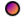 

```json
# 未実装: basic attributes only
{
  "type": "filled",
  "size": 10,
  "level": 0,
  "opacity": 1.0 // 透過度: 0.0 ~ 1.0
}
```

### ellipse (Ellipse)


```json
# 未実装: basic attributes only
{
  "type": "ellipse",
  "size": 10,
  "color": "#ff0000ff",
  "level": 0,
  "opacity": 1.0 // 透過度: 0.0 ~ 1.0
}
```

### mask (MaskMarker)

```json
# 未実装: basic attributes only
{
  "type": "unsupported",
  "size": 10,
  "color": "#ff0000ff",
  "level": 0,
  "opacity": 1.0 // 透過度: 0.0 ~ 1.0
}
```


## Line

### simple (SimpleLine)

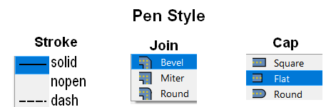

```json
{
  "type": "simple",
  "color": "#ff0000ff",
  "penstyle": {
    "stroke": "solid", // nopen | solid | dash
    "cap": "square", // flat | square | round
    "join": "bevel", // miter | bevel | round
    "dash_pattern": [2.0, 1.0, 4.0, 1.0], // stroke=dashのときのみ [実線(長さ), 間隔、実線、間隔...]
    // 例: [2, 1]       -> --  --  --  -- ...
    // 例: [4, 2]       -> ----  ----  ---- ...
    // 例: [2, 1, 4, 2] -> -- ----  -- ----  -- ...
  },
  "width": 2,
  "level": 1,
  "opacity": 1.0 // 透過度: 0.0 ~ 1.0
}
```

### marker (MarkerLine)

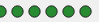

```json
{
  "type": "marker",
  "markers" [
    // point-svg の配列
    {
      "type": "svg",
      "size": 10,
      "color": "#ff0000ff",
      "outline_color": "#ff0000ff",
      "outline_width": 2,
      "asset_name": "some.svg",
      "level": 0,
      "opacity": 1.0
    }
  ]
  "interval": 2,
  "level": 1
}
```

### interpolated (InterpolatedLine)

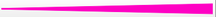

```json
# 未実装: basic attributes only
{
  "type": "interpolated",
  "color": "#ff0000ff",
  "width": 2,
  "level": 1,
  "opacity": 1.0 // 透過度: 0.0 ~ 1.0
}
```

### hashed (HashLine)

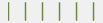

```json
# 未実装: basic attributes only
{
  "type": "hash",
  "level": 1,
  "opacity": 1.0 // 透過度: 0.0 ~ 1.0
}
```

### raster (RasterLine)


```json
# 未実装: basic attributes only
{
  "type": "raster",
  "width": 2,
  "level": 1,
  "opacity": 1.0 // 透過度: 0.0 ~ 1.0
}
```

### arrow (ArrowLine)

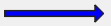

```json
# 未実装: basic attributes only
{
  "type": "arrow",
  "width": 2,
  "level": 1,
  "opacity": 1.0 // 透過度: 0.0 ~ 1.0
}
```

### lineburst (Lineburst)

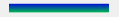

```json
# 未実装: basic attributes only
{
  "type": "lineburst",
  "width": 2,
  "level": 1,
  "opacity": 1.0 // 透過度: 0.0 ~ 1.0
}
```

## Polygon

### simple (SimpleFill)

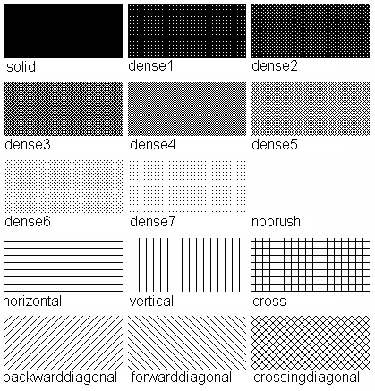

```json
{
  "type": "simple",
  "color": "#ff0000ff",
  "brushstyle": "solid", // nobrush | solid | dense1 | dense2 | dense3 | dense4 | dense5 | dense6 | dense7 | horizontal | vertical | cross | backwarddiagonal | forwarddiagonal | crossingdiagonal
  "outline_color": "#ff0000ff",
  "outline_width": 2,
  "outline_penstyle": {
    "stroke": "solid", // nopen | solid | dash | dot | dashdot | dashdotdot | customdash
    "join": "bevel" // miter | bevel | round
  },
  "level": 1,
  "opacity": 1.0 // 透過度: 0.0 ~ 1.0
}
```

### centroid (CentroidFill)

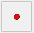

```json
# 未実装: basic attributes only
{
  "type": "centroid",
  "level": 1,
  "opacity": 1.0 // 透過度: 0.0 ~ 1.0
}
```

### pointpattern (PointPattern)

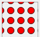

```json
# 未実装: basic attributes only
{
  "type": "pointpattern",
  "level": 1,
  "opacity": 1.0 // 透過度: 0.0 ~ 1.0
}
```

### randommarker (RandomMarker)’

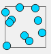

```json
# 未実装: basic attributes only
{
  "type": "randommarker",
  "level": 1,
  "opacity": 1.0 // 透過度: 0.0 ~ 1.0
}
```

### linepattern (LinePattern)

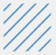

```json
# 未実装: basic attributes only
{
  "type": "linepattern",
  "level": 1,
  "opacity": 1.0 // 透過度: 0.0 ~ 1.0
}
```

### svg (SVGFill)

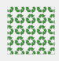

```json
# 未実装: basic attributes only
{
  "type": "svg",
  "color": "#ff0000ff",
  "outline_color": "#ff0000ff",
  "outline_width": 2,
  "level": 1,
  "opacity": 1.0 // 透過度: 0.0 ~ 1.0
}
```

### raster (RasterFill)

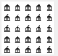

```json
# 未実装: basic attributes only
{
  "type": "raster",
  "color": "#ff0000ff",
  "outline_color": "#ff0000ff",
  "outline_width": 2,
  "level": 1,
  "opacity": 1.0 // 透過度: 0.0 ~ 1.0
}
```

### gradient (GradientFill)

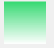

```json
# 未実装: basic attributes only
{
  "type": "gradient",
  "level": 1,
  "opacity": 1.0 // 透過度: 0.0 ~ 1.0
}
```

### shapeburst (ShapeburstFill)

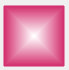

```json
# 未実装: basic attributes only
{
  "type": "shapeburst",
  "level": 1,
  "opacity": 1.0 // 透過度: 0.0 ~ 1.0
}
```

## 未実装のシンボル

### Polygon

- outline
  - Arrow
  - Hashed
  - Interpolated
  - Lineburst
  - Marker
  - Raster
  - Simple

## 対応予定のないシンボル

以下のシンボルは、対応予定がありません。`type=unsupported`として出力されます。

```json
{
  "type": "unsupported",
  "color": "#000000",
  "level": 0,
  "opacity": 1.0
}
```

### Point

- Mask Marker
- Vector Field Marker
- Geometry Generator

### Line

- Geometry Generator

### Polygon

- GeometryGenerator